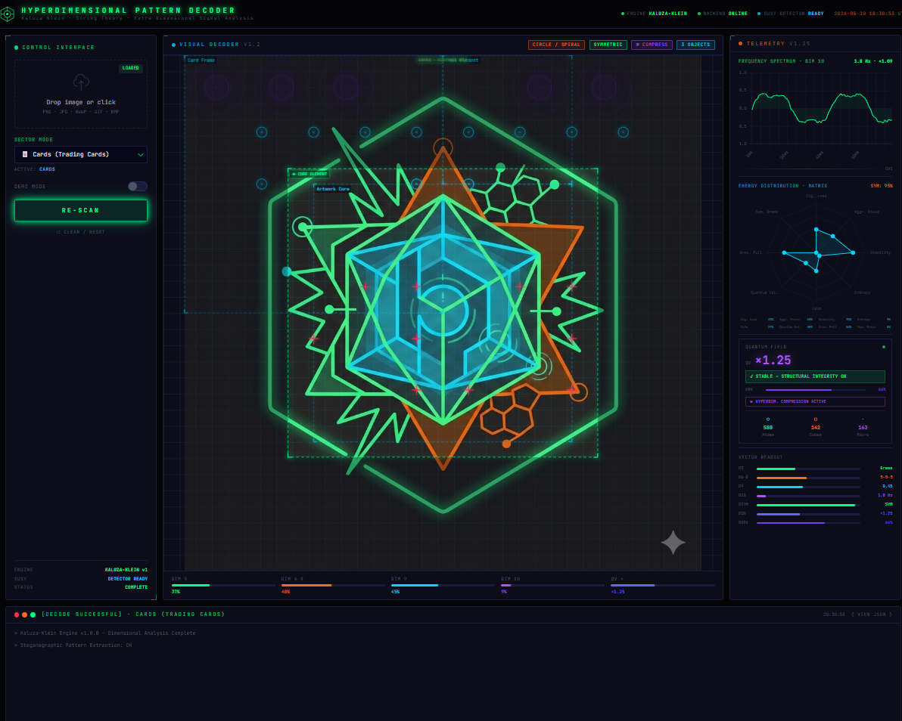
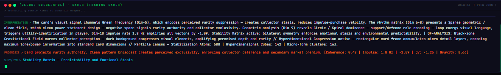
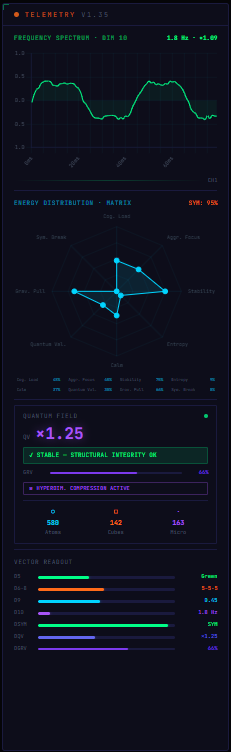

# Hyperdimensional Pattern Decoder · v1.35

**Cross-Field Steganographic Signal Analysis & Topological Environment Semantics via 10D Quantum Mapping**

> *"Every visual field encodes a signal. This engine reads it."*

[](https://python.org)
[](https://fastapi.tiangolo.com)
[](https://react.dev)
[](https://vitejs.dev)
[](https://tailwindcss.com)
[](https://opencv.org)
[](LICENSE)

---

## Table of Contents

1. [Theoretical Framework](#1-theoretical-framework)
2. [System Architecture](#2-system-architecture)
3. [8-Axis Energy Distribution Matrix](#3-8-axis-energy-distribution-matrix)
4. [Dimensional Analysis Map](#4-dimensional-analysis-map)
5. [Rhythm & Takt Classification System](#5-rhythm--takt-classification-system)
6. [Sector Modes](#6-sector-modes)
7. [Installation & Quick Start](#7-installation--quick-start)
8. [API Reference](#8-api-reference)
9. [Frontend Overview](#9-frontend-overview)
10. [Screenshots](#10-screenshots)
11. [Project Structure](#11-project-structure)

---

## 1. Theoretical Framework

The Hyperdimensional Pattern Decoder operates on the premise that **visual information is not merely aesthetic — it is a steganographic carrier signal** encoding structural, energetic, and semantic data across multiple dimensional planes simultaneously.

The engine's analytical model is grounded in three intersecting theoretical traditions:

### 1.1 Kaluza-Klein Extra-Dimension Framework

In Kaluza-Klein unified field theory, observable 4D spacetime is a projection of a higher-dimensional manifold. By analogy, this system treats every image as a **10-dimensional projection**: the visible pixel array is Dimension 4, while Dimensions 5 through 10 encode latent field properties — colour potential, rhythm density, geometric topology, and impulse frequency — that are not directly perceptible but are mathematically extractable.

### 1.2 Quantum Field Topology

Each image is modelled as a **topological field** containing:

- **Stabilization Atoms** — circular/smooth regions that introduce coherence and structural equilibrium
- **Hyperdimensional Cubes** — rectilinear regions that encode information density and compression fields
- **Luxury Particles** — the simultaneous presence of Black, Silver, and White tones, which multiplicatively amplify the steganographic value signal
- **Electromagnetic Break Events** — Yellow/angular field combinations that signal imminent symmetry collapse

The **Gravitational Field** (dark-pixel density), **EM-Break** (Yellow saturation), and **Oscillating Field** (2-3-2-3 rhythm alternation) form a three-body interaction system that governs the overall **Quantum Value Multiplier** output.

### 1.3 Supersymmetric Pairing (SUSY)

When bilateral symmetry falls within the 0.40–0.65 range, the system detects a **SUSY pairing state** — a partial symmetry that indicates two complementary energetic components in dynamic equilibrium. This is distinct from full symmetry (>0.65) and full asymmetry (<0.40), and carries its own semantic encoding in the output vocabulary.

---

## 2. System Architecture

```
┌─────────────────────────────────────────────────────────────────┐
│                     BROWSER  (React / Vite)                     │
│                                                                 │
│  UploadZone ──► SectorDropdown                                  │
│       │                                                         │
│       ▼                                                         │
│  DecoderOutput ◄──────────────────────────────────────────┐    │
│  ├─ TelemetryPanel  (live field readouts)                  │    │
│  ├─ EnergyRadarChart  (8-axis interactive spider chart)    │    │
│  ├─ FrequencyOscilloscope  (Dim-10 impulse waveform)       │    │
│  └─ ImageVisualizer  (bounding-box overlay)                │    │
│                                                            │    │
└────────────────────────────────────────────────────────────┼────┘
                          HTTP / multipart-form              │
                                                             │
┌────────────────────────────────────────────────────────────▼────┐
│                   FastAPI  (hd_engine)                          │
│                                                                 │
│  routes.py  ──►  HyperdimensionalAnalyzer  ──►  build_result   │
│                  │                              │               │
│                  │  analyzer.py                 │ translator.py │
│                  │  ─────────────               │ ──────────    │
│                  ├─ analyze_dimension_5()        ├─ _build_nuance_note()    │
│                  ├─ analyze_dimensions_6_8()     ├─ _build_extended_rhythm_note()│
│                  ├─ analyze_dimension_9()        ├─ _build_axis_interaction_note()│
│                  ├─ analyze_dimension_10()       ├─ _build_prognosis()      │
│                  ├─ analyze_symmetry()           └─ SECTOR_VOCABULARY       │
│                  ├─ analyze_quantum_field()                                 │
│                  ├─ detect_objects()                                        │
│                  └─ compute_radar_axes()                                    │
│                                                                 │
│  models.py  ──  Pydantic schema (AnalysisResult JSON contract)  │
└─────────────────────────────────────────────────────────────────┘
```

### Component Responsibilities

| Module | Role |
|---|---|
| `hd_engine/analyzer.py` | All computer-vision logic (OpenCV/NumPy). Stateless per-request. |
| `hd_engine/translator.py` | Semantic rule engine. Maps numeric vectors → steganographic text. |
| `hd_engine/models.py` | Pydantic data contract. Defines every JSON field and its constraints. |
| `hd_engine/routes.py` | FastAPI router. Validates, delegates, surfaces errors. Zero business logic. |
| `frontend/src/components/` | React UI. Consumes the JSON contract; renders all charts and readouts. |

---

## 3. 8-Axis Energy Distribution Matrix

The **Energy Distribution Matrix** (v1.35) is the primary multi-dimensional field readout. It encodes the state of the visual field across eight independent axes, visualised as an interactive radar (spider) chart.

| Axis | Index | Field Name | Derivation |
|------|-------|-----------|------------|
| **CL** | 0 | Cognitive Load | Dim 6-8 texture coherence score |
| **AF** | 1 | Aggressive Focus | Dim 9 edge curvature index |
| **ST** | 2 | Structural Stability | Symmetry class × QFM stability modifier |
| **IE** | 3 | Information Entropy | Dim 10 impulse rate (Hz), capped at 20 Hz → 1.0 |
| **CA** | 4 | Calm / Absorption | Dim 5 colour vector (Green dominant = direct; others inverted) |
| **QV** | 5 | Quantum Value | Composite QV multiplier, normalised to [0, 1] |
| **GP** | 6 | Gravitational Pull | Dark-pixel fraction (QFM gravitational density) |
| **SB** | 7 | Symmetry-Break Vector | Local asymmetry delta (0 when no asymmetry detected) |

### Stability Calculation

```
stability = base_score × stability_modifier

  base_score = 0.85  (SUSY detected)
             | 0.75  (fully symmetric)
             | 0.45  (asymmetric)

  stability_modifier = 0.65  (QFM status contains "Unstable")
                     | 1.00  (otherwise)
```

### Segment-Zoom Interaction

Clicking any axis label in the legend **normalises all eight values** so the selected axis lands at `1.0`. The polygon shifts to reveal inter-axis proportions that would otherwise be hidden when one axis dominates. Click the same axis again to reset to absolute values.

### Cross-Axis Interaction Engine

The semantic engine inspects cross-axis combinations and appends structured notes to the decoder output:

- **High Cognitive Load + High Entropy** → cognitive saturation, information overload signal
- **High Aggression + Low Stability** → collapse vector probability elevated
- **High Gravitational Pull + Low Quantum Value** → gravitational field suppressing value signal
- **High Calm + Low Entropy** → absorption field at maximum efficiency
- **SUSY field + High Quantum Value** → supersymmetric amplification cascade
- **High Symmetry-Break + High Aggression** → directed asymmetric force vector detected
- **Fibonacci Harmonic takt** → constructive harmonic interference pattern

---

## 4. Dimensional Analysis Map

The pipeline analyses five dimensional planes in sequence. Each produces a structured sub-model that feeds into the final semantic synthesis.

### Dimension 5 — Colour / Base Potential

Extracts dominant hue via saturation-weighted HSV voting. Vivid pixels outweigh desaturated ones proportionally to their chromatic intensity.

| Colour Class | HSV Conditions | Semantic Role |
|---|---|---|
| Yellow | H∈[20,35], S≥140, V≥130 | High-Luminance Resonance, maximum signal visibility |
| Orange | H∈[10,20], vivid | Warm impulse signal, elevated visibility |
| Brown | Warm hue, NOT yellow, dominance ≥1.5× yellow | Earth-Band, energetic stagnation |
| Pink | H∈[160,180]∪[0,10], moderate S | Magenta Interference, low-threat attractor |
| Green | H∈[40,85] | Absorption / Calm dominant |
| Cyan | H∈[85,100] | Open negotiation, dwell-time signal |
| Blue | H∈[100,130] | Cognitive authority, spatial dominance |
| Violet | H∈[130,160] | Depth signal, multi-layer encoding |

### Dimensions 6-8 — Rhythm / Texture Pattern Density

Measures edge-gradient density across four horizontal image strips. The ratio of densities across strips determines the **Takt signature** (see §5).

Output fields: `pattern_type`, `frequency_takt`, `coherence_score`, `semantic_state`.

### Dimension 9 — Geometry / Energy Distribution

FFT-based edge curvature analysis. High-frequency angular components → `edge_curvature_index → 1.0` (Triangle/Jagged). Smooth curves → index → 0.0 (Circle/Spiral).

For `CARDS` and `INDIVIDUUM` sectors, a **Central Focus Override** computes the curvature of the inner 1/3 crop only, preventing card-frame borders from misclassifying a round subject.

### Dimension 10 — Frequency / Impulse Rate

Maps overall visual complexity to an impulse frequency in Hz and an intensity multiplier that scales Dim-5 and Dim-9 vector outputs.

### Symmetry Analysis

Bilateral left/right mirror comparison. Three states:

| State | Score Range | Effect |
|---|---|---|
| Symmetric | >0.65 | Structural Stability base: 0.75 |
| SUSY Paired | 0.40–0.65 | Structural Stability base: 0.85 |
| Asymmetric | <0.40 | Structural Stability base: 0.45 |

### Quantum Field Metrics (v1.1+)

| Field | Condition | Trigger |
|---|---|---|
| Gravitational Density | Dark-pixel fraction | Suppresses QV when dominant |
| EM-Break | Yellow + angular, above threshold | Signals symmetry collapse |
| Oscillating Field | Alternating 2-3-2-3 takt | High-energy colour-shift trigger |
| Luxury Particle | Black + Silver + White simultaneous | QV multiplier boost |
| Hyperdimensional Compression | Rectangular zone + surrounding micro-forms | High information-density flag |

### Local Asymmetry (v1.2+)

Left-half vs right-half curvature comparison. When the asymmetry delta exceeds the threshold, a **Directed Flow Vector** is declared — spatial tension between the dominant and compressed halves. Feeds directly into the Symmetry-Break Vector axis (index 7).

---

## 5. Rhythm & Takt Classification System

The takt system classifies the spatial rhythm of the image by measuring edge-gradient density (`D`) across four equal horizontal strips.

| Takt Signature | Name | Condition | Semantic Meaning |
|---|---|---|---|
| `0-0-0-0` | **Absolute Stasis** | Edge density < 0.025 | Zero rhythmic activity; field in total suspension |
| `1-1-1-1` | **Singularity Impulse** | All strips near-equal, very high density | Maximum field coherence, singular energy spike |
| `1-1-2-3` | **Fibonacci Harmonic** | Strip ratios D:D:2D:3D (±45/50%) | Constructive harmonic interference; golden-ratio structural resonance |
| `2-2-2` | **Balanced Dense** | Uniformly high density | Controlled high-frequency field |
| `3-3-3` | **Balanced Medium** | Uniformly medium density | Stable mid-frequency rhythm |
| `4-4-4` | **Balanced Sparse** | Uniformly low density | Open field, minimal visual noise |
| `5-5-5` | **Minimal Trace** | Near-zero uniform density | Ghost field, residual signal only |
| `1-2-3-4` | **Progressive Acceleration** | Monotonically increasing density | Escalating energy gradient |
| `4-2-4-2` | **Oscillating Resonance** | Alternating high-low density | 2-3-2-3 oscillation pattern, EM-field charging |

Takt detection operates on the full image or, for `CARDS` sectors, on a pre-cropped organic-center focus zone to exclude decorative borders.

---

## 6. Sector Modes

The semantic vocabulary is fully parameterised by **sector mode**. The same dimensional vectors produce different steganographic interpretations depending on the analytical context selected.

| Sector ID | Label | Primary Application |
|---|---|---|
| `URBAN_AREA` | Urban Area (Cities) | Pedestrian-flow dynamics, spatial authority mapping, civic behavioural encoding |
| `INDIVIDUUM` | Individual / Person | Psychographic signal extraction, personality-field resonance, dominance indicators |
| `STOCKS` | Financial Instrument | Market sentiment encoding, trend-reversal signals, volatility field analysis |
| `CARDS` | Trading Card / Collectible | Rarity-signal extraction, chromatic value classification, collector-field resonance |
| `TOYS` | Toy / Collectible | Attention-capture mechanics, play-pattern encoding, demand-signal topology |

Sector mode is passed as a `sector_mode` form field in the POST request and normalised to uppercase server-side.

---

## 7. Installation & Quick Start

### Prerequisites

- Python 3.11+
- Node.js 18+
- `pip` / `venv`

### Backend Setup

```bash
# Clone the repository
git clone https://github.com/YOUR_USERNAME/hyperdimensional_pattern_decoder.git
cd hyperdimensional_pattern_decoder

# Create and activate a virtual environment
python -m venv .venv

# Windows PowerShell
.venv\Scripts\Activate.ps1

# macOS / Linux
source .venv/bin/activate

# Install Python dependencies
pip install fastapi uvicorn python-multipart pillow opencv-python-headless numpy pydantic
```

### Start the API Server

```bash
uvicorn main:app --reload --host 0.0.0.0 --port 8000
```

The API will be available at `http://localhost:8000`. Interactive docs at `http://localhost:8000/docs`.

### Frontend Setup

```bash
cd frontend
npm install
npm run dev
```

The dev server starts at `http://localhost:5173` and proxies `/api` calls to the FastAPI backend.

### One-Command Start (both services)

Open two terminals:

```bash
# Terminal 1 — API
uvicorn main:app --reload

# Terminal 2 — Frontend
cd frontend && npm run dev
```

---

## 8. API Reference

### `POST /api/analyze`

Run the full 10D dimensional analysis pipeline on an uploaded image.

**Request** — `multipart/form-data`

| Field | Type | Required | Description |
|---|---|---|---|
| `file` | image file | ✓ | JPEG, PNG, WebP, GIF, or BMP. Max 10 MB. |
| `sector_mode` | string | — | Analysis context. Default: `INDIVIDUUM`. |

**Response** — `application/json`

```jsonc
{
  "meta": {
    "timestamp": "2025-01-01T00:00:00Z",
    "sector_mode": "CARDS",
    "sector_label": "Trading Card / Collectible",
    "engine_version": "V1.35-NUANCE"
  },
  "dimensions_analysis": {
    "dim_5_color":    { "dominant_frequency": "Orange", "color_label": "Yellow", "vector_value": 0.87, "semantic_state": "..." },
    "dim_6_8_rhythm": { "pattern_type": "...", "frequency_takt": "1-1-2-3", "coherence_score": 0.72, "semantic_state": "..." },
    "dim_9_geometry": { "dominant_shape": "Triangle/Jagged", "edge_curvature_index": 0.81, "energy_distribution": "..." },
    "dim_10_frequency": { "impulse_rate_hz": 12.4, "intensity_multiplier": 1.62 },
    "symmetry":       { "is_symmetric": false, "is_susy": true, "symmetry_score": 0.54, "semantic_state": "..." },
    "quantum_field_metrics": {
      "detected_particles": { "circle_count": 3, "square_count": 1, "micro_cluster_count": 7 },
      "stability_status": "Stable",
      "gravitational_density": 0.18,
      "electromagnetic_break_detected": false,
      "oscillating_field_active": false,
      "luxury_particle_detected": false,
      "active_hyperdimensional_compression": true,
      "quantum_value_multiplier": 1.45
    },
    "radar_axes": [0.720, 0.810, 0.722, 0.620, 0.391, 0.380, 0.180, 0.000]
  },
  "decoder_output": {
    "status": "DECODE SUCCESSFUL",
    "interpretation": "...",
    "prognosis": "...",
    "field_warnings": []
  },
  "detected_objects": [
    {
      "id": "obj_1",
      "label": "Primary Signal Object",
      "bounding_box": [0.12, 0.08, 0.88, 0.92],
      "analysis": {
        "dim_5_color": { "..." },
        "dim_9_geometry": { "..." },
        "coherence_score": 0.68,
        "radar_axes": [0.68, 0.79, 0.72, 0.55, 0.40, 0.38, 0.14, 0.00],
        "interpretation": "..."
      }
    }
  ]
}
```

The `radar_axes` array always has exactly 8 elements, ordered:
`[Cognitive Load, Aggressive Focus, Structural Stability, Information Entropy, Calm/Absorption, Quantum Value, Gravitational Pull, Symmetry-Break Vector]`

### `GET /api/health`

Returns system status. Used by the frontend to detect backend availability.

### `GET /api/sectors`

Returns all valid sector mode IDs and their display labels.

---

## 9. Frontend Overview

### Chart Components

| Component | Description |
|---|---|
| `EnergyRadarChart` | 8-axis interactive radar chart with segment-zoom (click any axis to normalise against it) |
| `FrequencyOscilloscope` | Dim-10 impulse waveform rendered as an animated oscilloscope trace |
| `TelemetryPanel` | Live field readout panel: all 8 radar axis values, QFM flags, takt signature |
| `ImageVisualizer` | Canvas overlay rendering bounding boxes for all detected objects |
| `DecoderOutput` | Main interpretation panel: full semantic text, prognosis, field-warning chips |

### Technology Stack

| Layer | Technology |
|---|---|
| Build tool | Vite 5 + React 18 |
| Styling | Tailwind CSS 3 (JIT) |
| Charts | Chart.js 4 + react-chartjs-2 |
| Font | JetBrains Mono (Google Fonts) |
| HTTP client | Native `fetch` |
| Colour space | All analysis in OpenCV HSV (H: 0–180, S/V: 0–255) |

---

## 10. Screenshots

> *Interface renders in full-dark cyberpunk terminal aesthetic.*

| Upload & Sector Selection | Dimensional Readout | Radar Matrix (zoomed) |
|---|---|---|
|  |  |  |

---

## 11. Project Structure

```
hyperdimensional_pattern_decoder/
│
├── main.py                         # FastAPI application entry point
│
├── hd_engine/
│   ├── __init__.py
│   ├── analyzer.py                 # Computer-vision pipeline (OpenCV / NumPy)
│   ├── translator.py               # Semantic rule engine + sector vocabulary
│   ├── models.py                   # Pydantic data contract (full JSON schema)
│   └── routes.py                   # FastAPI router (validation + delegation)
│
├── frontend/
│   ├── public/
│   │   ├── favicon.svg             # SVG icon (primary, scales perfectly)
│   │   └── favicon.png             # PNG fallback (32×32, older Safari)
│   ├── src/
│   │   ├── main.jsx                # React app root
│   │   ├── App.jsx                 # Top-level layout
│   │   ├── index.css               # Global styles + Tailwind directives
│   │   ├── services/
│   │   │   └── api.js              # Typed API client
│   │   └── components/
│   │       ├── UploadZone.jsx
│   │       ├── SectorDropdown.jsx
│   │       ├── DecoderOutput.jsx
│   │       ├── TelemetryPanel.jsx
│   │       ├── ImageVisualizer.jsx
│   │       └── charts/
│   │           ├── EnergyRadarChart.jsx      # 8-axis radar + segment-zoom
│   │           └── FrequencyOscilloscope.jsx
│   ├── index.html
│   ├── vite.config.js
│   ├── tailwind.config.js
│   └── package.json
│
├── .gitignore
└── README.md
```

---

## License

MIT — see [LICENSE](LICENSE) for details.

---

*Hyperdimensional Pattern Decoder — v1.35 "Hyper-Rhythm & 8-Axis Field Extension"*
*Built with FastAPI · React · OpenCV · Tailwind CSS · Chart.js*
